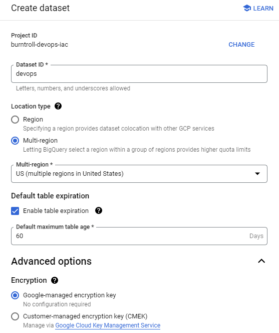
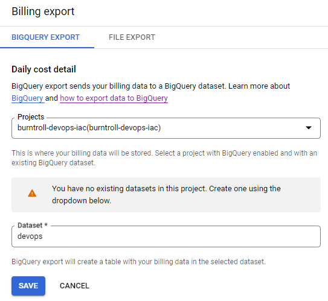
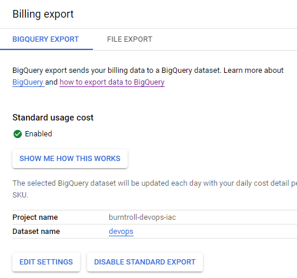
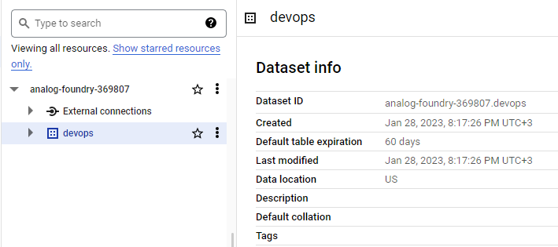
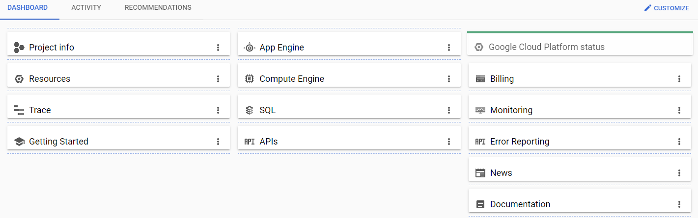

# GCP-SETUP

### Introduction

---

In this project, an organizational structure table is built and then a monthly budget is defined with some triggers for the indicated email.
Next, a BigQuery export is set up that sends the billing data to a BigQuery dataset.

In the end it shows how to make the dashboard customization

### Tools

---

* Draw.io
* Google GCP - Billing and Monitoring
* Google GCP - Billing Export
* Google GCP - BigQuery

### Result

---

### ORGANIZATIONAL STRUCTURE

### BILLING ACCOUNT - BUDGETS AND ALERTS

### BILLING EXPORT - BIGQUERY

### DASHBOARD CUSTOMIZATION

