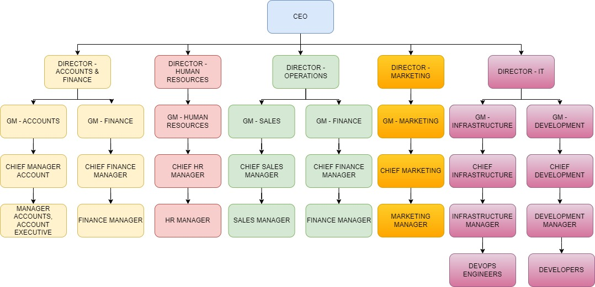
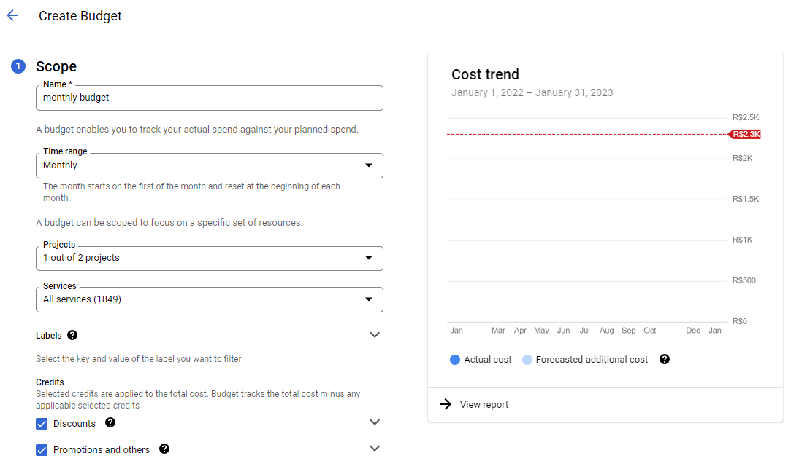
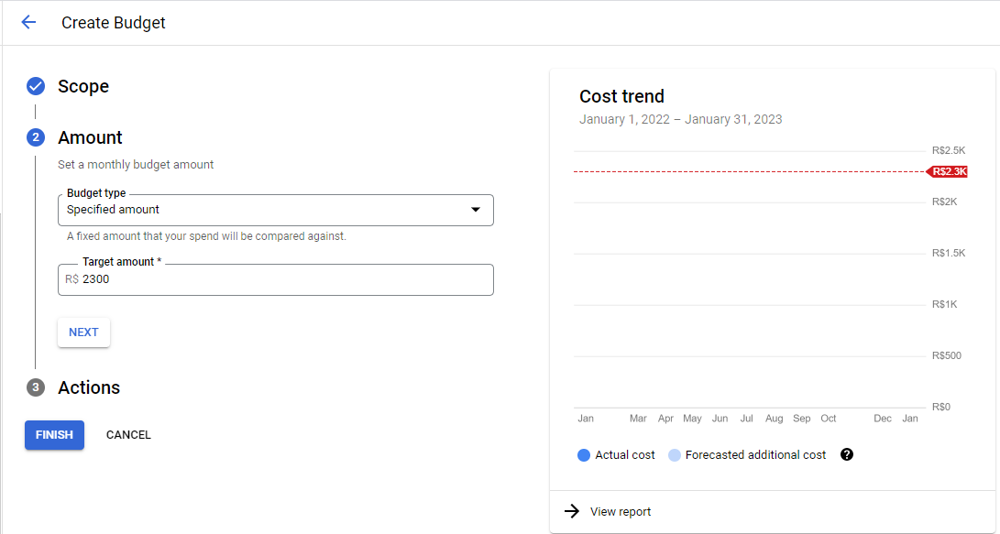
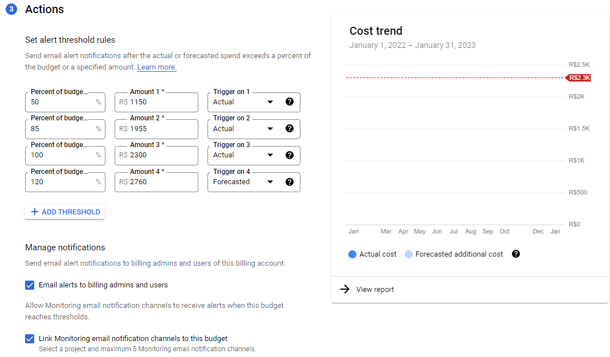
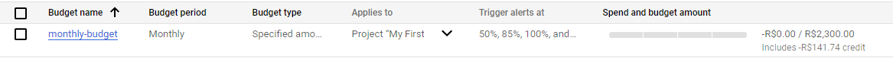

# GCP-SETUP

### Introduction

---

In this project, an organizational structure table is built and then a monthly budget is set with some triggers for the indicated email.

### Tools

---

* Draw.io
* Google GCP - Billing and Monitoring

### Result

---

**ORGANIZATIONAL STRUCTURE**

**BILLING ACCOUNT - BUDGETS AND ALERTS**

